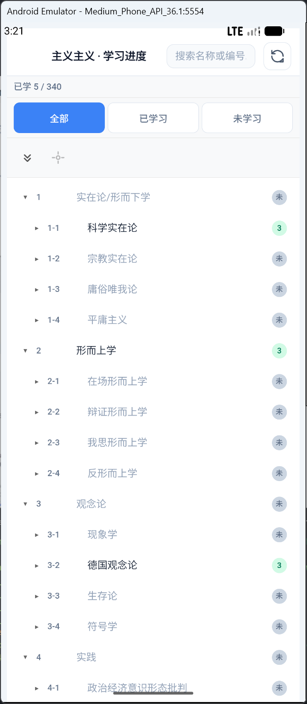
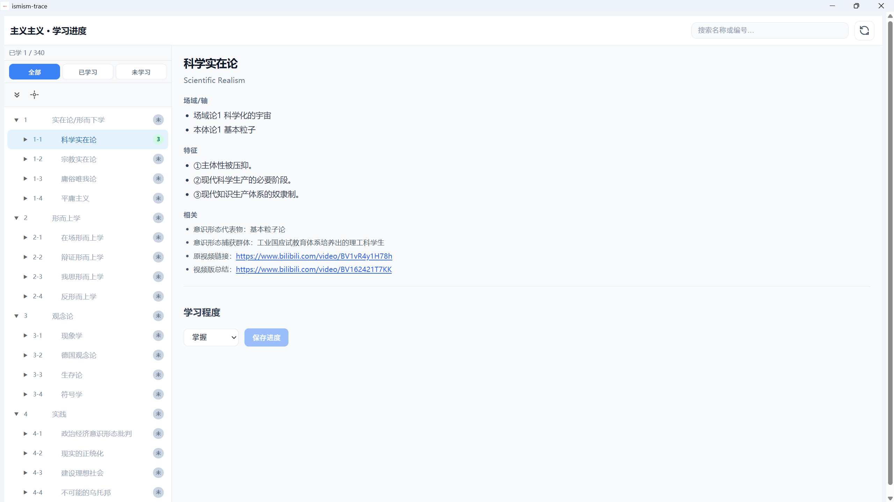

# ismism-trace

基于 Tauri + Vue 的跨平台「主义主义」学习进度管理应用。使用项目根目录的 `ism.json` 作为主义数据源，可记录每条主义的学习程度（未学习 / 了解 / 学习中 / 掌握 / 精通）。

## 环境与运行

- 安装依赖：`pnpm install`
- 桌面开发：`pnpm tauri dev`
- 桌面构建：`pnpm tauri build`
- Android 开发：需先执行 `pnpm tauri android init`，再使用 `pnpm tauri android dev`

## 发布

一键发布（自动检查版本、更新版本号、提交、创建 tag、推送并触发 CI 构建）：

```bash
pnpm release          # 智能版本：当前版本未发布则使用当前版本，已发布则 patch +1
pnpm release patch    # patch 版本（0.1.0 -> 0.1.1）
pnpm release minor    # minor 版本（0.1.0 -> 0.2.0）
pnpm release major    # major 版本（0.1.0 -> 1.0.0）
```

**版本管理逻辑：**
- 如果当前版本的 tag 在远程不存在 → 使用当前版本发布（不升级版本）
- 如果当前版本的 tag 在远程已存在 → 根据版本类型升级版本后再发布

推送 tag 后，GitHub Actions 会自动构建 Windows exe 和 Android APK，并创建 Release。详见 [打包说明 - 发布与 Tag](docs/build.md#发布与-taggithub-可浏览下载)。

## 文档

- [功能说明](docs/features.md)：列表层级、学习进度、筛选、链接、多端布局等
- [配置说明](docs/config.md)：学习程度配置、数据与存储说明
- [各平台打包说明](docs/build.md)：Windows / Android / macOS / Linux 构建命令与产物路径

## 推荐 IDE

VS Code + Vue - Official + Tauri + rust-analyzer

## 运行示意图

### Android



### Windows


